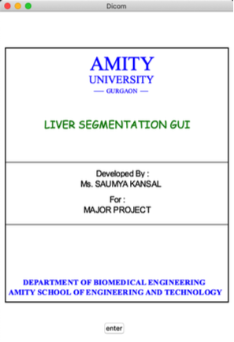
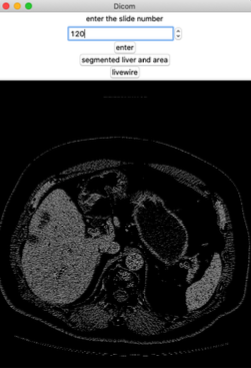
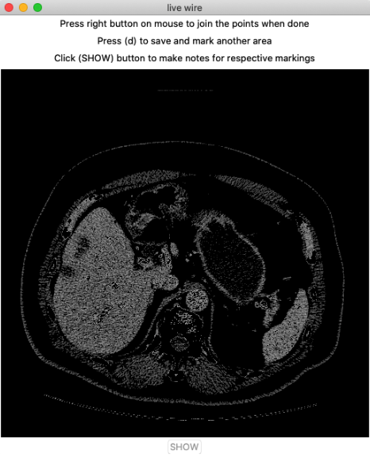
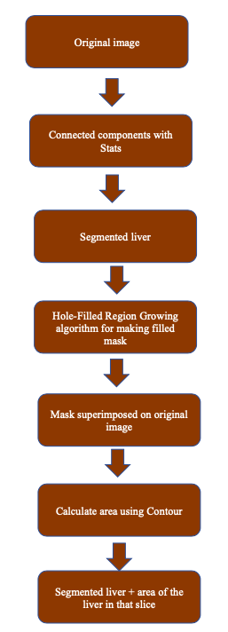
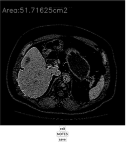
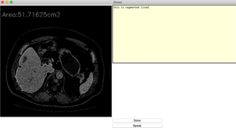
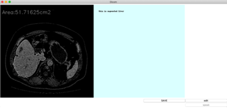

# Software_for_radiologists
An application where radiologist can manually segment a Dicom liver image (CT image) by selecting the slide they want to work on. After segmentation they can add notes by either using speech to text feature or by typing and save the notes along with the Dicom image as a jpg for further sharing and comparison. 
They can also run the automated version where segmentation is done using a region growing function of OpenCV library and contouring to find the area of the segmented liver.

## Implementations

1. Open command prompt
2. pip install pyinstaller
3. pyinstaller --onefile FILENAME. (in this case LIVER_GUI.ipynb)
4. Your .exe file will be in dist folder

You can share it to anyone irrespective of whether that person have Python on their system or not.

# First look

### Choose slide number

### Manual segmentation

### Automated segmentation process

### Automated segmentation with area

### Notes

### 
